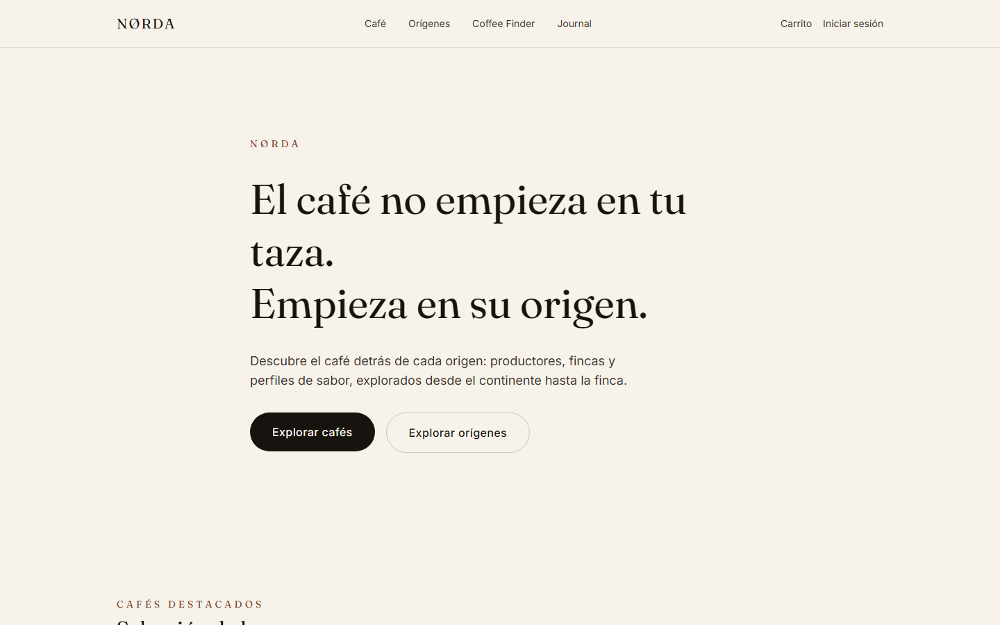
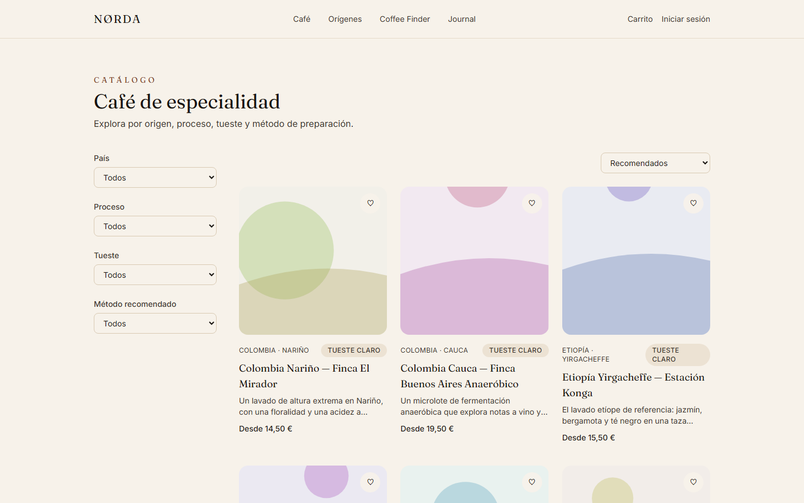
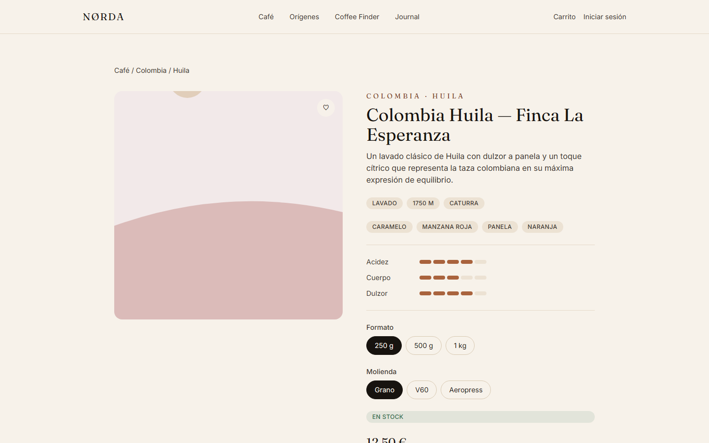
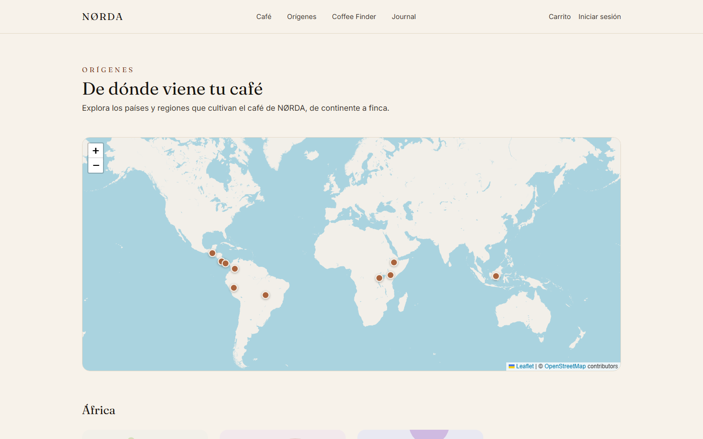
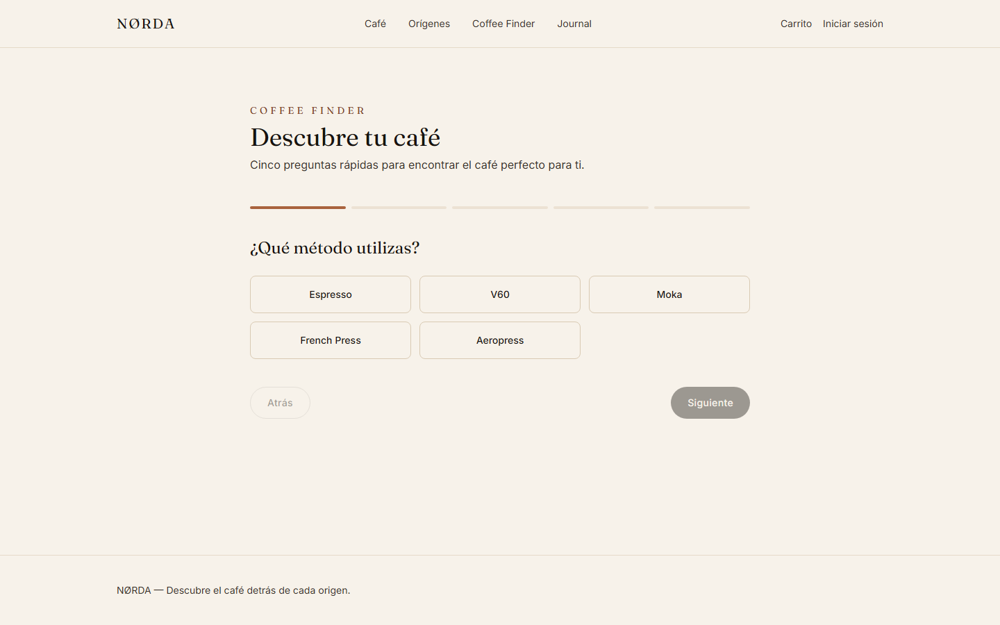
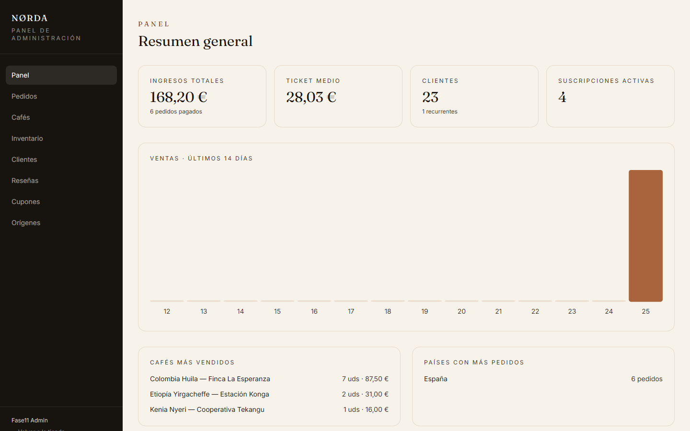

# NØRDA

**Descubre el café detrás de cada origen.**

NØRDA es una plataforma full-stack de café de especialidad centrada en el descubrimiento de
origen: mapa interactivo, un motor de recomendación personalizado (Coffee Finder), ecommerce
completo con checkout e inventario real, suscripciones, reseñas, un blog editorial con SEO
cuidado, y un panel de administración de nivel empresarial.

No es "una tienda online más": es un ejercicio de ingeniería full-stack real — backend como
única fuente de verdad de precio/stock/rol/pago, arquitectura de puertos y adaptadores para las
integraciones externas, tests de verdad, y documentación honesta de cada decisión y de sus
límites conocidos.

## Capturas

| | |
|---|---|
|  |  |
|  |  |
|  |  |
|  | |

## Qué se puede hacer hoy

- **Explorar el catálogo** por país, región, proceso, tueste y método de preparación, con fichas
  de producto que muestran trazabilidad completa (productor, finca, lote, cosecha).
- **Navegar el origen del café en un mapa interactivo** (mundial y por país), sin claves de API
  de terceros.
- **Usar el Coffee Finder**: 5 preguntas → hasta 3 recomendaciones explicadas ("te recomendamos
  X porque..."), con un motor de reglas determinista propio.
- **Comprar de verdad**: carrito, cupones de descuento, checkout con reserva atómica de
  inventario, cálculo de envío e impuestos, y confirmación de pedido — todo validado en backend.
- **Suscribirse** a una caja recurrente de café (fija, sorpresa, o por descubrimiento de origen).
- **Dejar reseñas** — solo quien compró un café puede reseñarlo.
- **Leer el Journal**: 8 artículos editoriales reales sobre método, origen y producción, con SEO
  dinámico y JSON-LD por página.
- **Administrar todo desde un panel propio**: dashboard con métricas reales, gestión de
  productos (con generación automática de variantes), pedidos con máquina de estados, inventario,
  clientes, reseñas, cupones y orígenes.

## Stack

| Capa | Tecnologías |
|---|---|
| Frontend | React 18 · TypeScript · Vite · Tailwind CSS 4 · React Router 7 · TanStack Query · Zod · React Hook Form · react-leaflet · react-helmet-async |
| Backend | Java 21 · Spring Boot 3.3 · Spring Security · Spring Data JPA · Flyway · PostgreSQL 16 |
| Pagos / Email / Envíos | Arquitectura de puertos y adaptadores: Stripe SDK integrado (modo demo activo, ver [ADR-004](docs/adr/ADR-004-payment-abstraction.md)) · `EmailService` · `ShippingProvider` |
| Testing | JUnit 5 + Mockito + Testcontainers (backend) · Vitest + React Testing Library (frontend) · Playwright (E2E + accesibilidad con axe-core) |

Ni el backend ni el frontend dependen de Docker para ejecutarse — es una comodidad opcional, no
un requisito (ver [`docs/architecture.md`](docs/architecture.md)).

## Estructura

```
norda/
├── backend/    API REST (Spring Boot), modular por dominio (auth, catalog, cart, order, admin...)
├── frontend/   SPA (React + Vite), con e2e/ para la suite de Playwright
├── docs/       Arquitectura, base de datos, API, seguridad, despliegue, ADRs
└── docker-compose.yml   Opcional: Postgres local + backend en contenedor
```

## Puesta en marcha

### Requisitos

- Java 21+ (no hace falta Maven instalado, se usa el wrapper `./mvnw`)
- Node.js 20+
- PostgreSQL 16 (local o gestionado) — **o**, opcionalmente, Docker

### 1. Base de datos

**Sin Docker:** instala PostgreSQL localmente y crea una base de datos `norda`.

**Con Docker (opcional):**
```bash
cp .env.example .env
docker compose up postgres
```

### 2. Backend

```bash
cd backend
./mvnw spring-boot:run
```

Arranca en `http://localhost:8080` con los valores por defecto de `application-local.yml`
(Postgres en `localhost:5432`, usuario/contraseña `postgres`). Flyway aplica las migraciones
automáticamente al arrancar — no hay paso manual. Health check: `GET /actuator/health`.

Variables de entorno relevantes (ver [`backend/.env.example`](backend/.env.example)):
`DATABASE_URL`, `DATABASE_USERNAME`, `DATABASE_PASSWORD`, `CORS_ALLOWED_ORIGINS`, `JWT_SECRET`,
`FRONTEND_URL`, `STRIPE_SECRET_KEY`/`STRIPE_WEBHOOK_SECRET` (opcionales en modo demo).

### 3. Frontend

```bash
cd frontend
cp .env.example .env
npm install
npm run dev
```

La app arranca en `http://localhost:5173`.

### 4. Primer usuario admin

No existe un endpoint público para crear un administrador (deliberado, ver
[`docs/security.md`](docs/security.md)). Regístrate normalmente desde la app y promociona esa
cuenta a `ADMIN` directamente en base de datos:

```sql
INSERT INTO user_roles (user_id, role) VALUES ('<tu-user-id>', 'ADMIN');
```

### Build de producción

```bash
# Backend: genera un JAR ejecutable autocontenido
cd backend && ./mvnw clean package -DskipTests
java -jar target/norda-backend.jar

# Frontend: genera estáticos desplegables en Vercel/Netlify/Cloudflare Pages
cd frontend && npm run build
```

Ver [`docs/deployment.md`](docs/deployment.md) para la guía de despliegue completa (variables de
entorno de producción, orden recomendado, health checks).

## Tests

```bash
# Backend: tests unitarios puros (no requieren Docker)
cd backend && ./mvnw test -Dtest="*Test" -DfailIfNoTests=false

# Backend: suite de integración completa (requiere Docker, vía Testcontainers)
cd backend && ./mvnw test

# Frontend: unitarios y de componente (Vitest + React Testing Library)
cd frontend && npm test

# Frontend: end-to-end (requiere el backend y el frontend corriendo)
cd frontend && npm run e2e
```

La suite E2E cubre registro/login, navegación del catálogo, carrito, checkout completo (con
regresión explícita del bug de doble-submit corregido durante el desarrollo), control de acceso
al panel admin, y accesibilidad automática (axe-core, WCAG 2.1 AA) en las 10 páginas públicas
principales.

## Documentación

- [`docs/architecture.md`](docs/architecture.md) — visión arquitectónica y principios
- [`docs/database.md`](docs/database.md) — esquema, migraciones, decisiones de modelado
- [`docs/api.md`](docs/api.md) — referencia completa de la API REST
- [`docs/security.md`](docs/security.md) — autenticación, autorización, y límites conocidos
- [`docs/deployment.md`](docs/deployment.md) — guía de despliegue
- [`docs/decisions.md`](docs/decisions.md) — índice de decisiones de arquitectura
- [`docs/adr/`](docs/adr) — Architecture Decision Records completas

## Límites conocidos

Documentados con la misma honestidad que el resto del proyecto, no ocultados:

- **Pagos en modo demo**: `DemoPaymentService` simula un cobro exitoso siempre; la integración
  real de Stripe (`StripePaymentService`) está diseñada y el webhook ya verifica firmas reales,
  pero no se activa sin credenciales de una cuenta Stripe real ([ADR-004](docs/adr/ADR-004-payment-abstraction.md)).
- **Sin prerenderizado/SSR**: las vistas previas de redes sociales (Slack, Twitter...) no
  reflejan el contenido específico de cada página, solo el genérico — los buscadores sí indexan
  correctamente porque ejecutan JavaScript ([ADR-007](docs/adr/ADR-007-seo-prerendering.md)).
- **Sin rate limiting**: no hay límite de intentos de login ni de creación de recursos a nivel de
  aplicación — necesario antes de exponer el backend a tráfico público sin restricciones de red
  (ver [`docs/security.md`](docs/security.md)).

## Licencia

Proyecto personal de portfolio. Todos los derechos reservados.
